### View [this nbviewer repository](https://nbviewer.org/github/kanru-wang/Distributed_Training_and_Quantization_Pruning_Distillation) if you have problem viewing the notebooks.

--------------------------------

 

## Model Quantization, Pruning, Knowledge Distillation and TFX pipeline

https://www.coursera.org/learn/machine-learning-modeling-pipelines-in-production

## Quantization

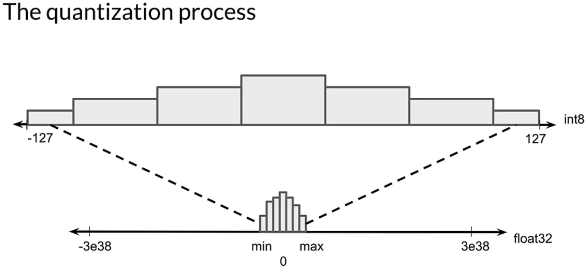

### TensorFlow Quantization

  - https://www.tensorflow.org/lite/performance/model_optimization

  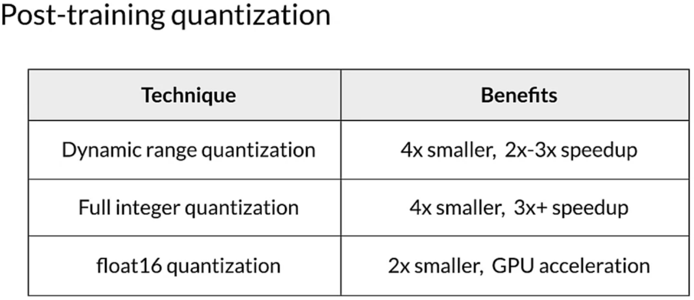

  - **Dynamic range quantization** converts weights to 8 bit precision. The activations are always stored in floating point, and are quantized to 8 bits of precision dynamically prior to processing and are de-quantized to float precision after processing. The weights are quantized post training and the activations are quantized dynamically at inference in this method.
  - **Integer / full integer quantization** converts 32-bit floating-point weights and activation outputs to the nearest 8-bit fixed-point numbers. Need a Representative Dataset to allow the converter to estimate a dynamic range for all the variable data.
  - **float16 quantization** converts weights to 16-bit floating point.

  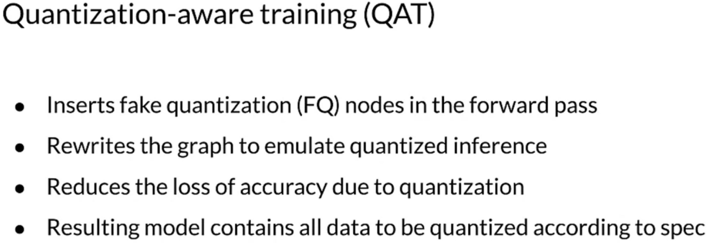

  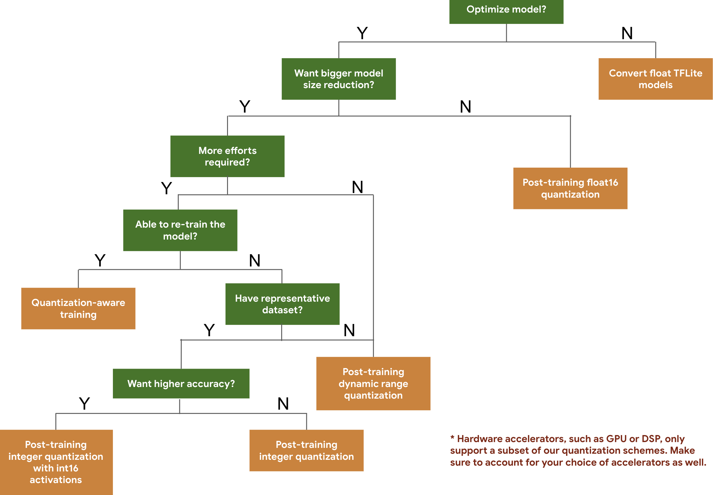

### PyTorch Quantization

- https://pytorch.org/blog/introduction-to-quantization-on-pytorch/
- https://pytorch.org/blog/quantization-in-practice/
- Dynamic Quantization
  - Convert the weights to int8, but also converting the activations to int8 on the fly, just before doing the computation (hence “dynamic”).
  - However, the activations are read and written to memory in floating point format.
- Post-Training Static Quantization
  - Also pre-quantizes model weights but instead of calibrating activations on-the-fly, the clipping range is pre-calibrated and fixed (“static”) using validation data. Specifically, this is done by inserting “observer” modules at different points that record these distributions. This information is used to determine how specifically the different activations should be quantized at inference time.
  - The pre-calibration step allows passing quantized values between operations instead of converting these values to floats - and then back to ints - between every operation, resulting in a significant speed-up.
- Quantization Aware Training
  - All weights and activations are “fake quantized” during both the forward and backward passes of training: that is, float values are rounded to mimic int8 values, but all computations are still done with floating point numbers. Thus, all the weight adjustments during training are made while “aware” of the fact that the model will ultimately be quantized; after quantizing, therefore, this method usually yields higher accuracy than the other two methods.
  - Quantization aware training is typically only used in CNN models when post training static or dynamic quantization doesn’t yield sufficient accuracy. This can occur with models that are highly optimized to achieve small size (such as Mobilenet).

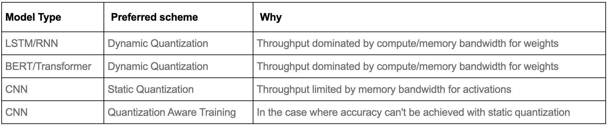

 
 

## Pruning

  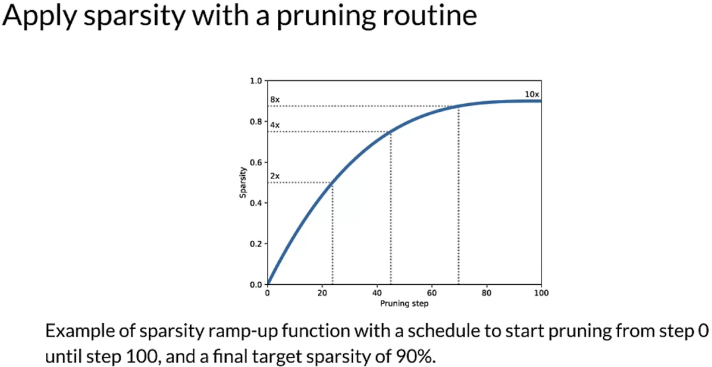

  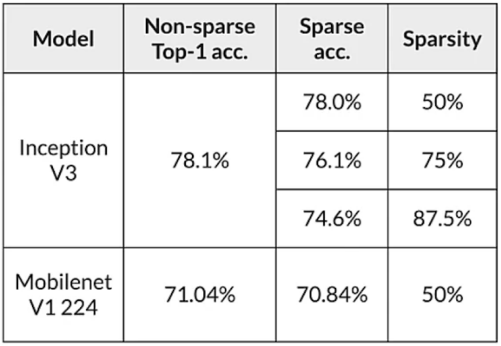

 
 

## Parallelism

- Data parallelism: Send a small batch of different data to each GPU, calculate the average of the gradients, and use the average of the gradients to update parameters.
- Model parallelism: Assign the first n layers to GPU #1, the second n layers to GPU #2, and so on. GPU #2 would wait for the output from GPU #1 during forward propagation, and so on.
- Pipeline parallelism
  - In below, F stands for forward propagation; B stands for backward propagation.
  - (Me: Each device computes for part of the model. F(2, 1) stands for forward propagation of Part 2 of the model on mini-batch 1) 
  - **Top graph**: The naive model parallelism strategy leads to severe underutilization due to the sequential nature of the network. Only one accelerator is active at a time.
  - **Bottom graph**: GPipe divides the input mini-batch into smaller micro-batches, enabling different accelerators to work on separate micro-batches at the same time.
  - For GPipe, Gradients are consistently accumulated across micro-batches, so that the number of partitions does not affect the model quality.
  - For GPipe, weights and activations are the same for the cycle in the graph, and are updated across devices before the next cycle.

   

  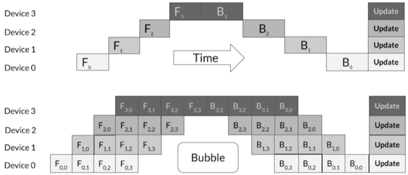

   

  - Google has GPipe, Microsoft as PipeDream. They make different tradeoffs

  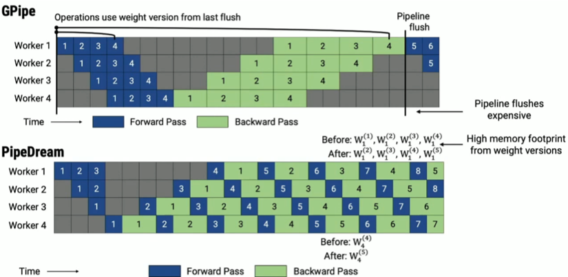

 
 

## Knowledge Distillation

- Knowledge is transferred from the teacher model to the student by minimizing a loss function, aimed at matching temperature-softened teacher logits as well as ground-truth labels.
- Loss is the weighted average of
  - (1) Teacher-student logits (predicted class distributions) Kullback-Leibler divergence loss, and
  - (2) Cross-entropy loss from the hard labels

  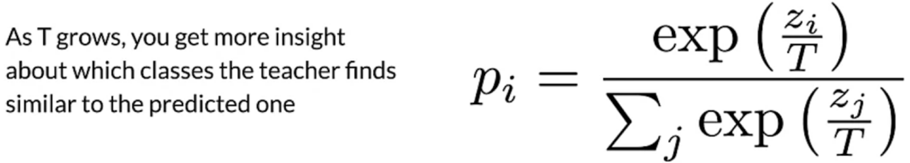
  
- In order to use the distiller, we need:
  - A trained teacher model
  - A student model to train
  - A student loss function on the difference between student predictions and ground-truth
  - A distillation loss function, along with a temperature, on the difference between the soft student predictions and the soft teacher labels
  - An alpha factor to weight the student and distillation loss
  - An optimizer for the student and (optional) metrics to evaluate performance

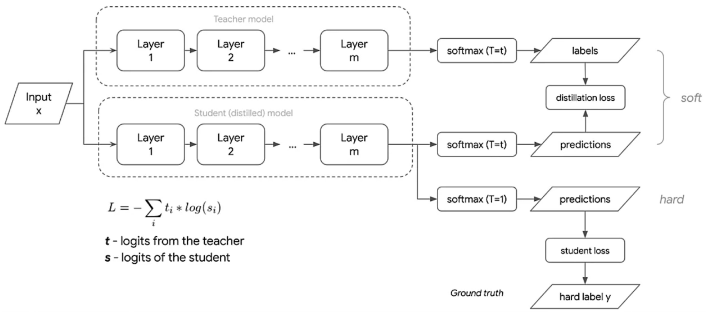

 
 

## Distributed Training

https://www.coursera.org/learn/custom-distributed-training-with-tensorflow

## Multi-GPU Mirrored Strategy 

How does `tf.distribute.MirroredStrategy` strategy work?

- All the variables and the model graph are replicated on the replicas.
- Input is evenly distributed across the replicas.
- Each replica calculates the loss and gradients for the input it received.
- The gradients are synced across all the replicas by summing them.
- After the sync, the same update is made to the copies of the variables on each replica.

The Multi Worker Mirrored Strategy uses multiple machines, but the Mirrored Strategy and TPU strategy use a single machine.

    strategy = tf.distribute.MirroredStrategy()
    
    BATCH_SIZE_PER_REPLICA = 64
    # With Mirrored Strategy, we have one replica per GPU device
    # Each variable in the model is mirrored across all replicas
    GLOBAL_BATCH_SIZE = BATCH_SIZE_PER_REPLICA * strategy.num_replicas_in_sync
    
    # Create Distributed Datasets from the datasets
    train_dataset = tf.data.Dataset...batch(GLOBAL_BATCH_SIZE)
    test_dataset = tf.data.Dataset...batch(GLOBAL_BATCH_SIZE)
    train_dist_dataset = strategy.experimental_distribute_dataset(train_dataset)
    test_dist_dataset = strategy.experimental_distribute_dataset(test_dataset)
    
    # Instead of model.compile(), will do custom training within a strategy scope
    # When defining the loss, set reduction to `none` so we can do the reduction afterwards (i.e. divide by global batch size).
    with strategy.scope():
        define loss
        define how to aggregate (e.g. avg) the loss
        define metric
        define optimizer
        define model structure
    
    # `per_replica_losses` is an array of losses, with each being the loss calculated on a replica.
    # Distributed training step receives the losses from each of the replicas and then reduce them (in this case, sum).
    # The summed loss is added to a cumulative total loss, which is then averaged, to become the training loss for this epoch.
    @tf.function
    def distributed_train_step(batch):
        per_replica_losses = strategy.run(train_step, args=(batch,))
        return strategy.reduce(
            tf.distribute.ReduceOp.SUM,
            per_replica_losses,
            axis=None
        )
    
    # train_step and test_step will be called `num_replicas_in_sync` times
    def train_step(inputs):
        ...normal code
        ...use what's defined in with strategy.scope()
    
    @tf.function
    def distributed_test_step(batch):
        return strategy.run(test_step, args=(batch,))
    
    def test_step(inputs):
        ...normal code
        ...use what's defined in with strategy.scope()
    
    for each epoch:
        for batch in train_dist_dataset:
            total_loss += distributed_train_step(batch)
            num_batches += 1
        train_loss = total_loss / num_batches
    
        for batch in test_dist_dataset:
            distributed_test_step(batch)
        ...
